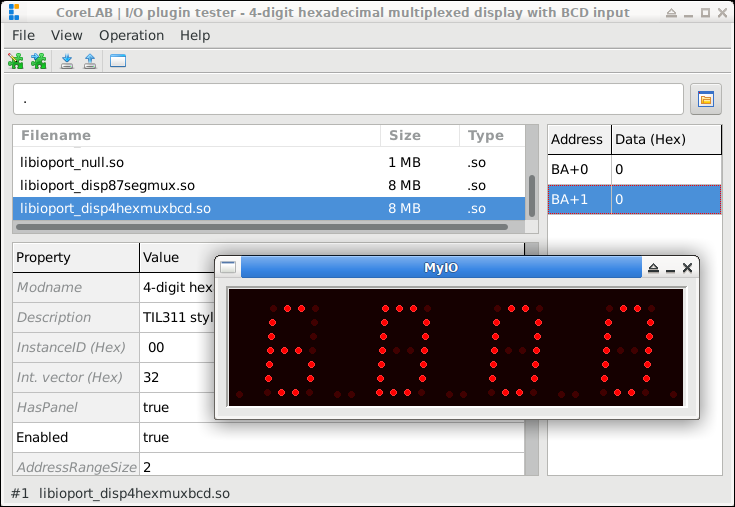
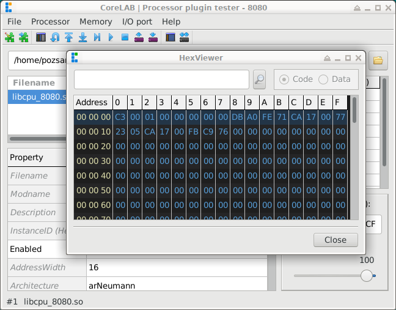
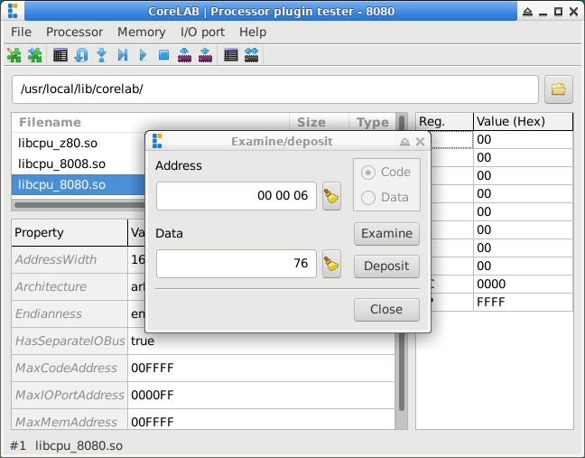
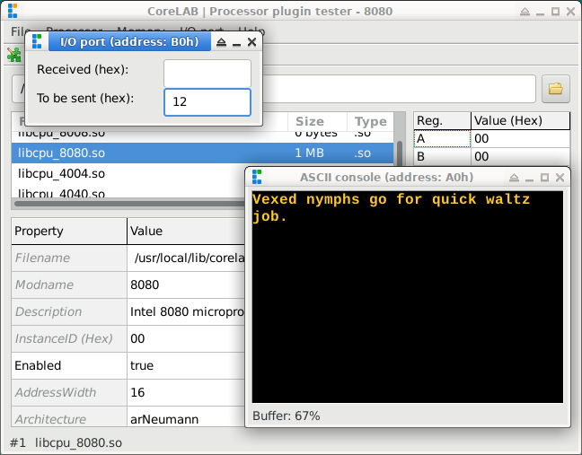

> [!WARNING]
> The program is still under development, it is not yet suitable for its task.  
>

# CoreLAB

**Modular Processor Simulation Framework**

Copyright (C) 2026 Pozsár Zsolt <pozsarzs@gmail.com>  

## I. Introduction and Project Goals

The CoreLAB project is a functional 8 bits microprocessor and microcontroller
simulator born from a fusion of academic research, technical passion, and
historical preservation. The project was initiated with several key objectives
in mind:

* **A Tribute to the Pioneers (Hardware and Human):** The project serves as a
    respectful nod to the early eras of computing architecture and the brilliant
    minds who designed them. By keeping the logic of these foundational
    processors alive, it preserves the digital heritage that paved the way for
    modern computing.
* **Learning Machine Code Programming:** It provides an accessible, hands-on
    educational platform to study low-level programming on classic architectures
    (such as the i40xx, i80xx, or TMS1000). Many of these physical chips are now
    rare, expensive, or completely obsolete, making software simulation the only
    viable way to experience them.
* **Academic Research (University Thesis):** The development of this simulator
    and its modular plugin system forms the core framework of my university
    thesis, exploring dynamic software architectures and instructional simulation
    methodologies.
* **Functional Execution over Full Emulation:** Unlike comprehensive emulators,
    the goal of CoreLAB is **not** to replicate entire vintage computer systems,
    run historical operating systems, or simulate cycle-accurate hardware quirks.
    Instead, it focuses strictly on the clean, functional execution of
    instructions, making the code's logic transparent and easy to analyze.
* **A Playground for System Design and Modeling:**  Beyond a simple educational
    tool, the project serves as a practical application of advanced system
    design and hardware modeling concepts. It provides a platform to explore
    how complex, real-world physical systems - such as buses, registers, memory
    layouts, and I/O lines - can be accurately modeled, decoupled, and
    reconfigured dynamically in software using modern software engineering
    patterns.
* **Bridging Vintage Logic with Modern Automation:** A key innovation of the
    project is wrapping these classic CPU architectures into a modern, scriptable
    environment. By allowing users to dynamically build topologies, manipulate
    registers, and automate tests via a command-line shell, it applies modern
    DevOps and debugging workflows to the foundational hardware of the past.

## II. Features

### General features

|Features                  |Specification / Description                                                      |
|--------------------------|---------------------------------------------------------------------------------|
|**project type**          |Functional processor simulator                                                   |
|**actual version**        |v0.1                                                                             |
|**licence**               |EUPL v1.2                                                                        |
|**language**              |en, hu                                                                           |
|**architecture**          |amd64, armhf, i386, x86_64                                                       |
|**operation system**      |FreeBSD, Linux, Windows                                                          |
|**user interface**        |Graphical User Interface (GUI) with scriptable command-line control              |
|**running modes**         |Normal or interpreter                                                            |
|**simulation type**       |Instruction-level operation (not cycle-accurate)                                 |
|**supported architecture**|Neumann and Harvard architectures                                                |
|**supported processors**  |Byte based uPs and simple MCUs                                                   |
|**simulation environment**|Configurable memory space and virtual I/O ports or devices                       |
|**modular architecture**  |Dynamically loadable CPUs and peripherals                                        |
|**dump**                  |Displaying memory and register contents, with export to binary or Intel HEX files|
|**logging**               |Runtime log exportable to file                                                   |
|**debug features**        |Breakpoints, memory monitoring, single-stepping, and commentable memory addresses|
|**program loading**       |Via keyboard entry or from binary/Intel HEX files                                |
|**state saving**          |Saving and restoring full environment state                                      |

### Integrated modules

|Features              |Specification / Description                                        |
|----------------------|-------------------------------------------------------------------|
|**Breakpoint Manager**|Managing breakpoints                                               |
|**HexViewer**         |Memory viewer component                                            |
|**IntLogger**         |Logging interrupt requests                                         |
|**Module Manager**    |Managing module instances                                          |
|**RegViewer**         |Real-time inspection of registers, program counter, and flag status|
|**RunLogger**         |Real-time output of address, machine code, and mnemonic            |
|**ScriptConsole**     |Console for show running script output                             |
|**ScriptEditor**      |Built-in environment for writing and executing control scripts     |
|**SysConsole**        |Console for system messages and command line interface             |

### Plug-in modules

|Features                               |Specification / Description                                                                  |
|---------------------------------------|---------------------------------------------------------------------------------------------|
|**Real Port Redirection**              |Bridges virtual port I/O streams directly to the physical hardware ports of the host machine.|
|**Simple Console**                     |Basic text-based console for data stream monitoring.                                         |
|**Virtual 7-Segment Display**          |Single and multiplexed 7-segment display arrays for numerical and basic character output.    |
|**Virtual CPU**                        |Emulated processor, microprocessor with custom architectures.                                |
|**Virtual Hexadecimal Display**        |Single and multiplexed hex display arrays mapped to virtual port addresses.                  |
|**Virtual LED Array and Matrix**       |Linear LED bars and dot-matrix displays for visual bit-state and coordinate-based output.    |
|**Virtual Memory (RAM/ROM)**           |Configurable volatile and non-volatile memory blocks with custom sizing and address mapping. |
|**Virtual Pushbutton Array and Matrix**|Linear and matrix-arranged momentary pushbuttons for interactive binary input.               |
|**Virtual Switch Array and Matrix**    |Linear and matrix-arranged toggle switches providing persistent binary data to virtual ports.|

## III. Screenshots

### CoreLAB framework application

(...)

### CLIOPort plugin tester application

### CLMemory plugin tester application

### CLProcessor plugin tester application

## IV. Used external libraries, programs and others

 - _Fugue Icons_
   (C) 2013 Yusuke Kamiyamane
   CCA v3.0
 - _InpOut32 v1.0.07 Driver Interface DLL_ [^1]  
   Windows Dynamic Link Library (DLL)  
   (C) 2003-2015 Phil Gibbons  
   (C) 2000 <logix4u.net>  
   Open source/freeware  
 - _LHelp v2021-02-12 CHM help viewer_  
   (C) 2005-2014 Andrew Haines, Lazarus contributors  
   GNU GPL v2.0 or later

## V. About the program

### Project Management

CoreLAB uses a simple directory-based project structure. A project directory can
contain all related files—such as optional environment setup scripts, saved state
snapshots, program code, and data streams. The simulation environment can also be
built manually, meaning none of these files are strictly mandatory. This setup
keeps experiments independent while fully supporting the use of external files.

### Modular Architecture

One of the most important features of the simulator is its modular design.
Processors, memories, and peripherals can be created as independent objects and
connected dynamically. Users can build custom virtual hardware environments
tailored to the requirements of the system being studied.

### Supported Processor Architectures

CoreLAB is not limited to a single processor type. Different CPU, microprocessor,
and microcontroller architectures can be loaded as plug-ins. This enables the
same environment to be used for studying multiple instruction sets and hardware
models.

### Virtual Memory and I/O Environment

The memory map and I/O address space can be configured freely during simulation.
Virtual peripherals can be assigned to memory locations or I/O ports in the same
way as real hardware devices.

### Debugging Features

CoreLAB provides several built-in diagnostic and debugging tools. Users can halt
execution at breakpoints, execute programs step by step, inspect memory and
register contents, and monitor instruction execution in real time. These features
are especially useful for educational purposes and low-level software
development.

### Scripting and Automation

The program is primarily operated through its own built-in console command line,
though a menu is also available. It features a custom command interpreter and
scripting language. Scripts can be executed directly from the OS shell; when run
this way, the script automatically builds the execution environment and performs
all specified operations. This allows for the efficient automation of repetitive
tasks, tests, and the reproduction of complex hardware configurations.

### State Saving and Restoration

The complete state of a simulation can be saved and restored at any time. This
includes not only memory contents but also the current state of processors,
peripherals, and other objects. As a result, development and debugging sessions
can be paused and resumed without loss of progress.

### Logging and Data Export

Runtime events and execution logs can be saved to files for later analysis.
Memory contents can be exported in binary or Intel HEX format, allowing results
to be used with other development tools or transferred to real hardware.

## VI. Used filetypes

|extension|type                 |application                    |
|:-------:|:--------------------|:------------------------------|
|*.clprj  |CoreLAB project      |CoreLAB                        |
|*.clsht  |CoreLAB snapshot     |CoreLAB                        |
|*.clsce  |CoreLAB scriptembly  |CoreLAB                        |
|*.clpst  |CoreLAB plugin status|CLIOPort, CLMemory, CLProcessor|
|*.bin    |General binary file  |CoreLAB, CLProcessor           |
|*.hex    |Intel hexa file      |CoreLAB, CLProcessor           |
|*.log    |General log file     |CoreLAB, CLProcessor           |

## VII. Implemented commands  

|name  |description                                                                       |
|:----:|----------------------------------------------------------------------------------|
|`ABS` |Replace target value with its absolute value in-place.                            |
|`ADD` |Add value to target in-place.                                                     |
|`AND` |Bitwise/logical AND in-place.                                                     |
|`APPX`|Terminate simulation environment.                                                 |
|`ASCI`|Convert ASCII character to its byte value.                                        |
|`ATTH`|Connect a hardware module to the bus.                                             |
|`BIT` |Check the specified bit.                                                          |
|`CALL`|Call subroutine.                                                                  |
|`CALM`|Call object's method.                                                             |
|`CHAR`|Convert byte size value to its ASCII character representation.                    |
|`COMP`|Compare target with value by subtraction.                                         |
|`CONV`|Convert number in different numeral systems in-place.                             |
|`CRTE`|Instantiate a hardware module or debug form.                                      |
|`DEC` |Decrement integer target by 1 or by count in-place.                               |
|`DEPO`|Deposit (write) a value directly into memory, register or bus address.            |
|`DEST`|Delete an object and free its memory.                                             |
|`DETH`|Disconnect a module from the bus.                                                 |
|`END` |End of script.                                                                    |
|`EXAM`|Examine (read) a value from memory, register or bus address into a variable.      |
|`EXIT`|Terminate the script.                                                             |
|`FILL`|Fill an array with a specific byte value.                                         |
|`GETP`|Get object's property.                                                            |
|`HELP`|Display general help overview or detailed usage for a specific command.           |
|`IDV` |Perform integer division on target in-place.                                      |
|`IMD` |Perform integer division remainder on target in-place.                            |
|`INC` |Increment integer target by 1 or by count in-place.                               |
|`INDX`|Search for a value in an array and then return it with its index in the exit code.|
|`INPW`|Show prompt window and read user input into a variable.                           |
|`INRG`|Check if value is between min and max.                                            |
|`JPEQ`|Jump to the specified label, based on the result of the previous CMP.             |
|`JPGE`|Jump to the specified label, based on the result of the previous CMP.             |
|`JPGT`|Jump to the specified label, based on the result of the previous CMP.             |
|`JPLE`|Jump to the specified label, based on the result of the previous CMP.             |
|`JPLT`|Jump to the specified label, based on the result of the previous CMP.             |
|`JPNE`|Jump to the specified label, based on the result of the previous CMP.             |
|`JPNZ`|Jump to the specified label, based on the result of the previous CMP.             |
|`JPZR`|Jump to the specified label, based on the result of the previous CMP.             |
|`MSGW`|Show modal message window.                                                        |
|`MUL` |Multiply target by value in-place in-place.                                       |
|`NOT` |Bitwise/logical NOT in-place.                                                     |
|`OR`  |Bitwise/logical OR in-place.                                                      |
|`PAUS`|Pause the running simulation without resetting state.                             |
|`POPA`|Retrieve an result from the argument stack after return from subroutine.          |
|`PRNT`|Write text to console.                                                            |
|`PSHA`|Store an argument to the argument stack for next `CALL` or `CALM` instruction.    |
|`RDV` |Perform floating-point division on target in-place.                               |
|`RSET`|Reset the simulation and all connected hardware modules to initial state.         |
|`RTRN`|Return from subroutine.                                                           |
|`SAPP`|Append value or variable to the end of target string in-place.                    |
|`SDEL`|Delete characters from target starting at index in-place.                         |
|`SETP`|Set object's property.                                                            |
|`SETV`|Create variable and/or assign value to variable or array element.                 |
|`SFND`|Find index of substring in target and store 0-based result.                       |
|`SHL` |Shift target bits left by count in-place.                                         |
|`SHR` |Shift target bits right by count in-place.                                        |
|`SINS`|Insert substring into target at specified index in-place.                         |
|`SLEN`|Store the character count of target string into a variable.                       |
|`SLOW`|Convert target string to lowercase in-place.                                      |
|`SREP`|Replace occurrences of old substring with new substring in target in-place.       |
|`SSUB`|Extract a substring from target starting at index into result variable.           |
|`STEP`|Execute a single clock cycle or instruction step in the simulation.               |
|`STOP`|Halt the simulation and terminate current execution loop.                         |
|`STRT`|Start or resume simulation execution continuous mode.                             |
|`SUB` |Subtract value from target in-place.                                              |
|`SUPP`|Convert target string to uppercase in-place.                                      |
|`SWAP`|Swap the values of two variables.                                                 |
|`WAIT`|Wait specified ms.                                                                |
|`XOR` |Bitwise/logical XOR in-place.                                                     |

## VIII. Command exit codes

| v.|category        |description                 |
|:-:|:---------------|----------------------------|
| 0 |                |Sucess                      |
| 1 |General error   |General error               |
| 2 |General error   |Wrong parameter number      |
| 3 |General error   |Invalid syntax              |
|10 |Data error      |Variable not found          |
|11 |Data error      |Type error                  |
|12 |Data error      |Read-only target            |
|13 |Data error      |Index error / array boundary|
|14 |Data error      |Class not found             |
|15 |Data error      |Object not found            |
|16 |Data error      |Property not found          |
|17 |Data error      |Method not found            |
|20 |Simulation error|General error               |
|21 |Simulation error|Attach/Detach error         |

## IX. System constants  

|name     |value                                    |
|:--------|:----------------------------------------|
|`$?`     |exit value of the commands               |
|`$ARGCNT`|number of the OS command line arguments  |
|`$ARG[n]`|OS command line arguments                |
|`$DATE`  |date                                     |
|`$FC`    |carry flag                               |
|`$FZ`    |zero flag                                |
|`$HOME`  |user's home directory                    |
|`$INSCNT`|total number of executed CPU instructions|
|`$PRJDIR`|directory of the actual project          |
|`$RNDB`  |gives a random byte                      |
|`$RNDI`  |gives a random integer                   |
|`$RNDW`  |gives a random word                      |
|`$TIME`  |time                                     |
|`$VER`   |application version                      |

## X. Documentation and Help  

CoreLAB features built-in help and comprehensive documentation, accessible
through the following channels:

- Command-line assistance: Type the help command in the terminal to directly
  access usage guides and command references.
- Graphical Help: Under the Help menu in the graphical interface, you can find
  visual guides regarding the software's operation and supported CPU
  architectures.
- Source code documentation: Detailed developer assistance and documentation
  for the source code are available in the document folder.
- Additionally, you can view the manual page from *nix shell (_man corelab_) or
  _corelab.txt_ on other systems.  

## XI. Contributing  

If you find any bugs, please report them! I am also happy to accept pull
requests from anyone. You can use the GitHub issue tracker to report bugs, ask
questions, or suggest new features. See [CODE_OF_CONDUCT.md](CODE_OF_CONDUCT.md)
for details.  

## XII. Links  

 - [Homepage](https://www.pozsarzs.hu/60_myprogcom/corelab/)  
 - [GitHub repository](https://github.com/pozsarzs/corelab/tree/CoreLAB8)  
 - [Project webpage on Github](https://pozsarzs.github.io/corelab)  

### Source packages  

|name                                                                                 |version|
|-------------------------------------------------------------------------------------|:-----:|
|[main.zip](https://github.com/pozsarzs/corelab/archive/refs/heads/CoreLAB8.zip)      |latest |
|[corelab-0.1.tar.gz](https://www.pozsarzs.hu/60_myprogcom/package/corelab-0.1.tar.gz)|v0.1   |

### Binaries and installer packages for several OS and architecture

Not all test versions have binary or installation packages.
To download, visit [CoreLAB's webpage](https://www.pozsarzs.hu/60_myprogcom/corelab/).

[^1]: [InpOut32 Github repository](https://github.com/ellysh/InpOut32)
