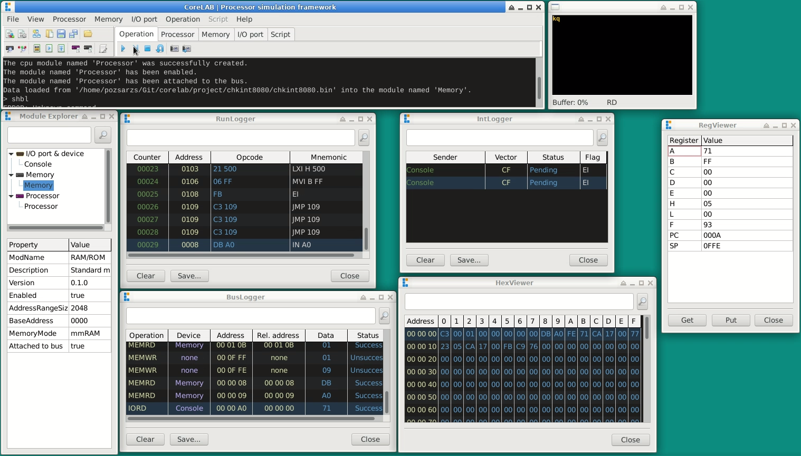
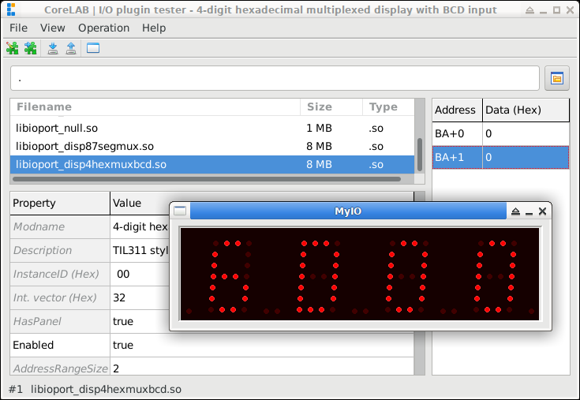
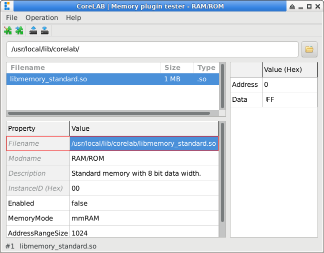
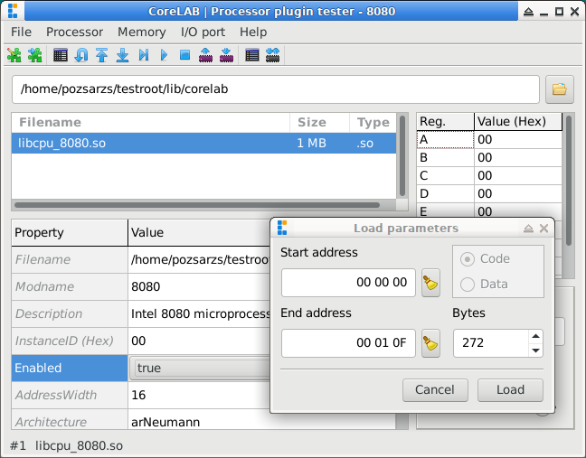
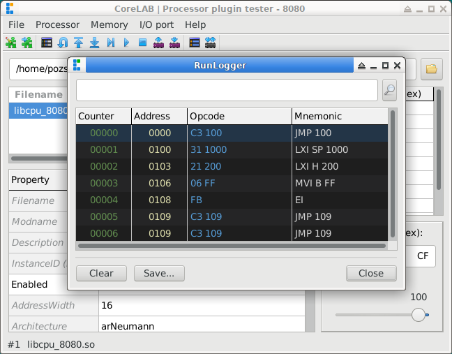
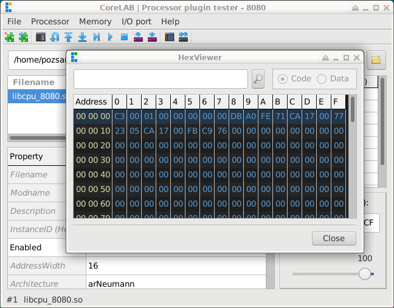
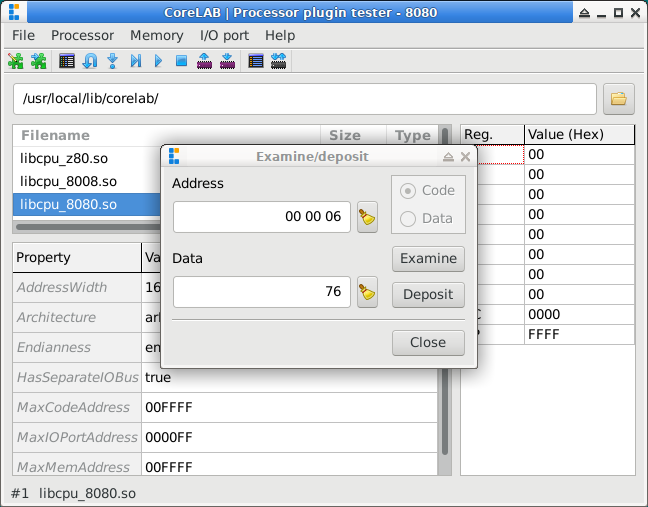
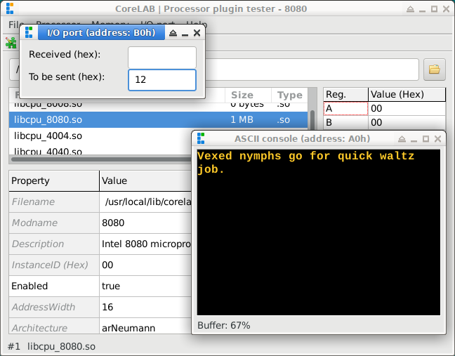

> [!WARNING]
> The program is still under development, it is not yet suitable for its task.  
>

# CoreLAB

**Modular Processor Simulation Framework**

Copyright (C) 2026 Pozsár Zsolt <pozsarzs@gmail.com>  

## I. Introduction and project goals

The CoreLAB project is a functional 8 bit microprocessor and microcontroller
simulator born from a fusion of academic research, technical passion, and
historical preservation. The project was initiated with several key objectives
in mind:

* **A tribute to the pioneers (hardware and human):** The project serves as a
    respectful nod to the early eras of computing architecture and the brilliant
    minds who designed them. By keeping the logic of these foundational
    processors alive, it preserves the digital heritage that paved the way for
    modern computing.
* **Learning machine code programming:** It provides an accessible, hands-on
    educational platform to study low-level programming on classic architectures
    (such as the i40xx, i80xx, or TMS1000). Many of these physical chips are now
    rare, expensive, or completely obsolete, making software simulation the only
    viable way to experience them.
* **Academic research (university thesis):** The development of this simulator
    and its modular plugin system forms the core framework of my university
    thesis, exploring dynamic software architectures and instructional simulation
    methodologies.
* **Functional execution over full emulation:** Unlike comprehensive emulators,
    the goal of CoreLAB is **not** to replicate entire vintage computer systems,
    run historical operating systems, or simulate cycle-accurate hardware quirks.
    Instead, it focuses strictly on the clean, functional execution of
    instructions, making the code's logic transparent and easy to analyze.
* **A playground for system design and modeling:**  Beyond a simple educational
    tool, the project serves as a practical application of advanced system
    design and hardware modeling concepts. It provides a platform to explore
    how complex, real-world physical systems - such as buses, registers, memory
    layouts, and I/O lines - can be accurately modeled, decoupled, and
    reconfigured dynamically in software using modern software engineering
    patterns.
* **Bridging vintage logic with modern automation:** A key innovation of the
    project is wrapping these classic CPU architectures into a modern, scriptable
    environment. By allowing users to dynamically build topologies, manipulate
    registers, and automate tests via a command-line shell, it applies modern
    DevOps and debugging workflows to the foundational hardware of the past.

## II. Features

### General features

|Features                  |Specification / Description                                        |
|--------------------------|-------------------------------------------------------------------|
|**project type**          |Functional processor simulator                                     |
|**actual version**        |v0.1                                                               |
|**licence**               |EUPL v1.2                                                          |
|**language**              |en, hu                                                             |
|**architecture**          |amd64, armhf, i386, x86_64                                         |
|**operation system**      |FreeBSD, Linux, Windows                                            |
|**user interface**        |Graphical User Interface (GUI) with scriptable command-line control|
|**running modes**         |Normal or interpreter                                              |
|**simulation type**       |Instruction-level operation (not cycle-accurate)                   |
|**supported architecture**|Neumann and Harvard architectures                                  |
|**supported processors**  |Byte based uPs and simple MCUs                                     |
|**simulation environment**|Configurable memory space and virtual I/O ports or devices         |
|**modular architecture**  |Dynamically loadable CPUs and peripherals                          |

### Integrated modules

|Features              |Specification / Description                            |
|----------------------|-------------------------------------------------------|
|**Breakpoint Manager**|Managing breakpoints                                   |
|**BusLogger**         |Logging system bus traffic                             |
|**HexViewer**         |Memory viewer component                                |
|**IntLogger**         |Logging interrupt requests                             |
|**Module Explorer**   |Managing module instances                              |
|**RegViewer**         |Real-time inspection of registers                      |
|**RunLogger**         |Real-time output of address, machine code, and mnemonic|
|**ScriptConsole**     |Console for showing running script output              |
|**ScriptEditor**      |Built-in environment for writing control scripts       |
|**SysConsole**        |Console for system messages and command line interface |

### Plug-in modules

|Features                               |Specification / Description                                                                  |
|---------------------------------------|---------------------------------------------------------------------------------------------|
|**Real port redirection**              |Bridges virtual port I/O streams directly to the physical hardware ports of the host machine.|
|**Simple console**                     |Basic text-based console for data stream monitoring.                                         |
|**Virtual 7-segment display**          |Single and multiplexed 7-segment display arrays for numerical and basic character output.    |
|**Virtual CPU**                        |Emulated processor, microprocessor with custom architectures.                                |
|**Virtual hexadecimal display**        |Single and multiplexed hex display arrays mapped to virtual port addresses.                  |
|**Virtual LED array and matrix**       |Linear LED bars and dot-matrix displays for visual bit-state and coordinate-based output.    |
|**Virtual memory (RAM/ROM)**           |Configurable volatile and non-volatile memory blocks with custom sizing and address mapping. |
|**Virtual pushbutton array and matrix**|Linear and matrix-arranged momentary pushbuttons for interactive binary input.               |
|**Virtual switch array and matrix**    |Linear and matrix-arranged toggle switches providing persistent binary data to virtual ports.|

## III. Screenshots

### CoreLAB framework application

### CLIOPort plugin tester application

### CLMemory plugin tester application

### CLProcessor plugin tester application

## IV. Used external libraries, programs and others

 - _Fugue Icons_
   (C) 2013 Yusuke Kamiyamane
   CCA v3.0
 - _InpOut32 v1.0.07 Driver Interface DLL_ [^1]  
   Windows Dynamic Link Library (DLL)  
   (C) 2003-2015 Phil Gibbons  
   (C) 2000 <logix4u.net>  
   Open source/freeware  
 - _LHelp v2021-02-12 CHM help viewer_  
   (C) 2005-2014 Andrew Haines, Lazarus contributors  
   GNU GPL v2.0 or later

## V. About the program

### Project management

CoreLAB uses a simple directory-based project structure. A project directory can
contain all related files-such as optional environment setup scripts, program
code, and data streams. The simulation environment can also be built manually,
meaning none of these files are strictly mandatory. This setup keeps experiments
independent while fully supporting the use of external files.

### Modular architecture

One of the most important features of the simulator is its modular design.
Processors, memories, and peripherals can be created as independent objects and
connected dynamically. Users can build custom virtual hardware environments
tailored to the requirements of the system being studied.

### Supported processor architectures

CoreLAB is not limited to a single processor type. Different microprocessor and
microcontroller architectures can be loaded as plug-ins. This enables the same
environment to be used for studying multiple instruction sets and hardware
models.

### Virtual memory and I/O environment

The memory map and I/O address space can be configured freely during simulation.
Virtual peripherals can be assigned to memory locations or I/O ports in the same
way as real hardware devices.

### Debugging features

CoreLAB provides several built-in diagnostic and debugging tools. Users can halt
execution at breakpoints, execute programs step by step, inspect memory and
register contents, and monitor instruction execution in real time. These features
are especially useful for educational purposes and low-level software
development.

### Scripting and automation

The program is primarily operated through its own built-in console command line,
though a menu is also available. It features a custom command interpreter and
scripting language. Scripts can be executed directly from the OS shell; when run
this way, the script automatically builds the execution environment and performs
all specified operations. This allows for the efficient automation of repetitive
tasks, tests, and the reproduction of complex hardware configurations.

### Logging and data export

Runtime events and execution logs can be saved to files for later analysis.
Memory contents can be exported in binary or Intel HEX format, allowing results
to be used with other development tools or transferred to real hardware.

#### Used filetypes

|extension|type                 |application                    |
|:-------:|:--------------------|:------------------------------|
|*.bin    |General binary file  |CoreLAB, CLProcessor           |
|*.clprj  |CoreLAB project      |CoreLAB                        |
|*.clpst  |CoreLAB plugin status|CLIOPort, CLMemory, CLProcessor|
|*.clsce  |CoreLAB scriptembly  |CoreLAB                        |
|*.clsht  |CoreLAB snapshot     |CoreLAB                        |
|*.hex    |Intel hexa file      |CoreLAB, CLProcessor           |
|*.log    |General log file     |CoreLAB, CLProcessor           |

## VI. Internal registers

The program does not use user-definable constants or variables. Type-independent
temporary data storage and access to system constants are provided by 16
registers. Of these, 10 are general-purpose, while the 11th is a working
register used by instructions as an accumulator.

Registers can store string and double word values.

|registers|description                |access|
|:-------:|:--------------------------|:----:|
|R0-9     |General register           | R/W  | 
|RA       |Work register (accumulator)| R/W  | 
|RB       |Work directory             | RO   | 
|RC       |Script instruction counter | RO   | 
|RD       |CPU instruction counter    | RO   | 
|RE       |Random byte                | RO   | 
|RF       |Flags (000000CZ)           | RO   |

|flag|name    |description                |
|:--:|--------|---------------------------|
| C  |Carry   |Unsigned overflow or carry.|
| Z  |Zero    |The result is zero.        |

## VII. Implemented commands

|instruction|mode        |RA |flags|description                                                            |
|:---------:|:----------:|:-:|:---:|-----------------------------------------------------------------------|
|**ADD**    |Script      |Yes|C, Z |Add value to target in-place.                                          |
|**AND**    |Script      |Yes|Z    |Bitwise/logical AND in-place.                                          |
|**ATIO**   |Everywhere  |-  |-    |Attach I/O port or device module to bus.                               |
|**ATME**   |Everywhere  |-  |-    |Attach memory module to bus.                                           |
|**ATPU**   |Everywhere  |-  |-    |Attach processor module to bus.                                        |
|**BIT**    |Script      |Yes|Z    |Check the specified bit.                                               |
|**CALL**   |Script      |-  |-    |Call subroutine.                                                       |
|**CFIO**   |Everywhere  |-  |-    |Configure I/O port module.                                             |
|**CFME**   |Everywhere  |-  |-    |Configure memory module.                                               |
|**CFPU**   |Everywhere  |-  |-    |Configure processor module.                                            |
|**CHWD**   |Everywhere  |-  |-    |Change work directory.                                                 |
|**COMP**   |Script      |Yes|C, Z |Compare target with value by subtraction.                              |
|**CONV**   |Script      |Yes|-    |Convert number in different numeral systems in-place.                  |
|**CRIO**   |Everywhere  |-  |-    |Instantiate a I/O port or device module.                               |
|**CRME**   |Everywhere  |-  |-    |Instantiate a memory module.                                           |
|**CRPU**   |Everywhere  |-  |-    |Instantiate a processor module.                                        |
|**DEC**    |Script      |Yes|C, Z |Decrement integer target by 1 in-place.                                |
|**DIIO**   |Everywhere  |-  |-    |Disable I/O port or device module.                                     |
|**DIME**   |Everywhere  |-  |-    |Disable memory module.                                                 |
|**DIPU**   |Everywhere  |-  |-    |Disable processor module.                                              |
|**DSIO**   |Everywhere  |-  |-    |Destroy I/O port or device module.                                     |
|**DSME**   |Everywhere  |-  |-    |Destroy memory module.                                                 |
|**DSPU**   |Everywhere  |-  |-    |Destroy processor module.                                              |
|**DTIO**   |Everywhere  |-  |-    |Detach I/O port or device module from bus.                             |
|**DTME**   |Everywhere  |-  |-    |Detach memory module from bus.                                         |
|**DTPU**   |Everywhere  |-  |-    |Detach processor module from bus.                                      |
|**EDME**   |Command line|-  |-    |Show examine/deposit window.                                           |
|**END**    |Script      |-  |-    |End of script.                                                         |
|**ENIO**   |Everywhere  |-  |-    |Enable I/O port or device module.                                      |
|**ENME**   |Everywhere  |-  |-    |Enable memory module.                                                  |
|**ENPU**   |Everywhere  |-  |-    |Enable processor module.                                               |
|**EXAP**   |Everywhere  |-  |-    |Exit from application.                                                 |
|**EXIT**   |Script      |-  |-    |Terminate the script.                                                  |
|**HELP**   |Command line|-  |-    |Display general help overview or detailed usage for a specific command.|
|**INC**    |Script      |Yes|C, Z |Increment integer target by 1 in-place.                                |
|**INRG**   |Script      |Yes|-    |Check if value is between min and max.                                 |
|**JPEQ**   |Script      |-  |-    |Jump to the specified label, based on the result of the previous CMP.  |
|**JPGE**   |Script      |-  |-    |Jump to the specified label, based on the result of the previous CMP.  |
|**JPGT**   |Script      |-  |-    |Jump to the specified label, based on the result of the previous CMP.  |
|**JPLE**   |Script      |-  |-    |Jump to the specified label, based on the result of the previous CMP.  |
|**JPLT**   |Script      |-  |-    |Jump to the specified label, based on the result of the previous CMP.  |
|**JPNE**   |Script      |-  |-    |Jump to the specified label, based on the result of the previous CMP.  |
|**JPNZ**   |Script      |-  |-    |Jump to the specified label, based on the result of the previous CMP.  |
|**JPZR**   |Script      |-  |-    |Jump to the specified label, based on the result of the previous CMP.  |
|**LDME**   |Everywhere  |-  |-    |Load memory content from file.                                         |
|**LDPR**   |Command line|-  |-    |Change to interactive mode and load project from file.                 |
|**LDRG**   |Script      |Yes|     |Load a value to specified register.                                    |
|**LDSC**   |Command line|-  |-    |Change to script mode and load script from file.                       |
|**LTIO**   |Everywhere  |-  |-    |Set position of I/O device panel.                                      |
|**MUL**    |Script      |Yes|C, Z |Multiply target by value in-place.                                     |
|**NMI**    |Everywhere  |-  |-    |Call non-maskable interrupt.                                           |
|**NOT**    |Script      |Yes|Z    |Bitwise/logical NOT in-place.                                          |
|**NWPR**   |Command line|-  |-    |Change to interactive mode and create new project.                     |
|**NWSC**   |Command line|-  |-    |Change to script mode and create new script.                           |
|**OR**     |Script      |Yes|Z    |Bitwise/logical OR in-place.                                           |
|**PRNT**   |Script      |-  |-    |Write text to console.                                                 |
|**RDIO**   |Script      |Yes|     |Read a value from I/O port and store in register RA.                   |
|**RDME**   |Script      |Yes|     |Read a value from memory and store in register RA.                     |
|**RNIO**   |Everywhere  |-  |-    |Rename I/O device panel.                                               |
|**RSAP**   |Everywhere  |-  |-    |Restart application.                                                   |
|**RSIO**   |Everywhere  |-  |-    |Reset I/O port or device module.                                       |
|**RSME**   |Everywhere  |-  |-    |Reset memory module.                                                   |
|**RSPU**   |Everywhere  |-  |-    |Reset processor module.                                                |
|**RST**    |Everywhere  |-  |-    |Reset all module.                                                      |
|**RTRN**   |Script      |-  |-    |Return from subroutine.                                                |
|**RUN**    |Everywhere  |-  |-    |Run simulation.                                                        |
|**RUSC**   |Command line|-  |-    |Run script.                                                            |
|**RWIO**   |Command line|-  |-    |Show read/write window.                                                |
|**SESC**   |Command line|-  |-    |Run script step-by-step.                                               |
|**SHBM**   |Command line|-  |-    |Show BreakPoint Manager window.                                        |
|**SHHV**   |Everywhere  |-  |-    |Show HexViewer window.                                                 |
|**SHIL**   |Everywhere  |-  |-    |Show IntLogger window.                                                 |
|**SHIO**   |Everywhere  |-  |-    |Show I/O device panel.                                                 |
|**SHL**    |Script      |Yes|C, Z |Shift target bits left by count in-place.                              |
|**SHME**   |Command line|-  |-    |Show Module Explorer window.                                           |
|**SHR**    |Script      |Yes|C, Z |Shift target bits right by count in-place.                             |
|**SHRL**   |Everywhere  |-  |-    |Show RunLogger window.                                                 |
|**SHRV**   |Everywhere  |-  |-    |Show RegViewer window.                                                 |
|**SHSC**   |Everywhere  |-  |-    |Show ScriptConsole window.                                             |
|**SHSE**   |Command line|-  |-    |Show ScriptEditor window.                                              |
|**STEP**   |Everywhere  |-  |-    |Run simulation step-by-step.                                           |
|**STOP**   |Everywhere  |-  |-    |Stop simulation.                                                       |
|**STSC**   |Command line|-  |-    |Stop script.                                                           |
|**SUB**    |Script      |Yes|C, Z |Subtract value from target in-place.                                   |
|**SVME**   |Everywhere  |-  |-    |Save memory content to file.                                           |
|**SVPR**   |Command line|-  |-    |Save project to file.                                                  |
|**SVSC**   |Command line|-  |-    |Save script to file.                                                   |
|**SWAP**   |Script      |Yes|-    |Swap the values of two registers.                                      |
|**WAIT**   |Script      |-  |-    |Wait specified ms.                                                     |
|**WHIO**   |Everywhere  |-  |-    |Set size of I/O device panel.                                          |
|**WRIO**   |Script      |Yes|     |Read a value from register RA and write to I/O port.                   |
|**WRME**   |Script      |Yes|     |Read a value from register RA and store in memory.                     |
|**XOR**    |Script      |Yes|Z    |Bitwise/logical XOR in-place.                                          |

**Note:**  
- RA: The instruction uses the _RA_ register as both source and destination.
- flags: The instruction may modify specific flag bits of the _RF_ register.

## VIII. Documentation and help  

CoreLAB features built-in help and comprehensive documentation, accessible
through the following channels:

- Command-line assistance: Type the help command in the terminal to directly
  access usage guides and command references.
- Graphical Help: Under the Help menu in the graphical interface, you can find
  visual guides regarding the software's operation and supported CPU
  architectures.
- Source code documentation: Detailed developer assistance and documentation
  for the source code are available in the document folder.
- Additionally, you can view the manual page from *nix shell (_man corelab_).  

## IX. Contributing  

If you find any bugs, please report them! I am also happy to accept pull
requests from anyone. You can use the GitHub issue tracker to report bugs, ask
questions, or suggest new features. See [CODE_OF_CONDUCT.md](CODE_OF_CONDUCT.md)
for details.  

## X. Links  

 - [Homepage](https://pozsarzs.github.io/corelab)  
 - [GitHub Page](https://github.com/pozsarzs/corelab)  
 - [GitHub Releases](https://github.com/pozsarzs/corelab/releases)
 
[^1]: [InpOut32 Github repository](https://github.com/ellysh/InpOut32)
