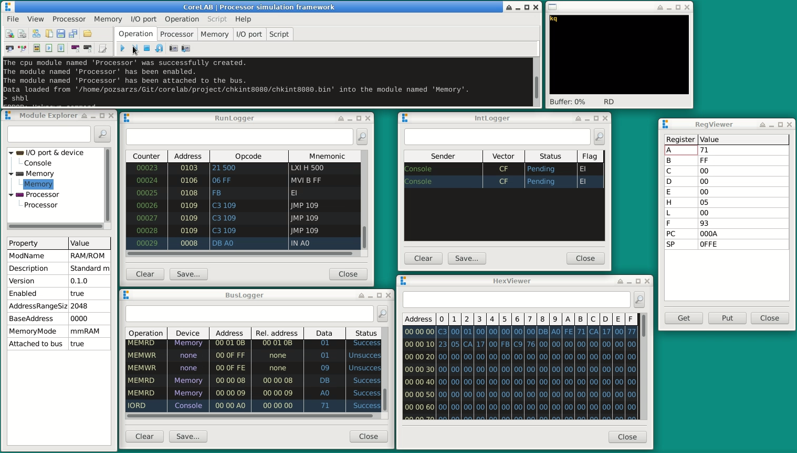
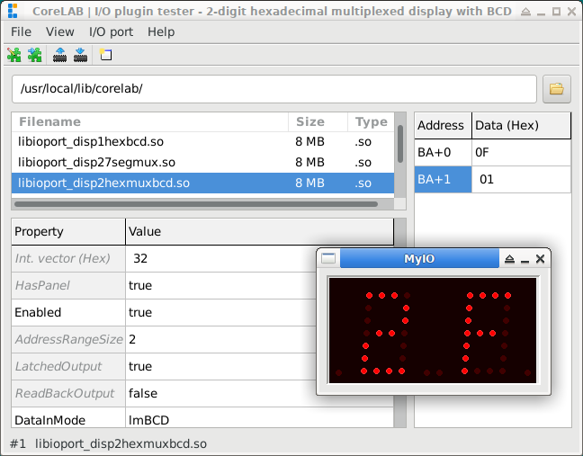
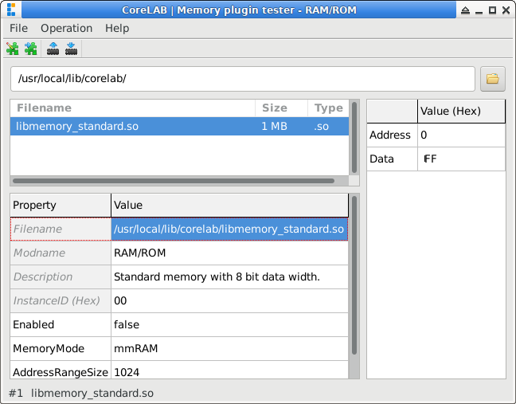
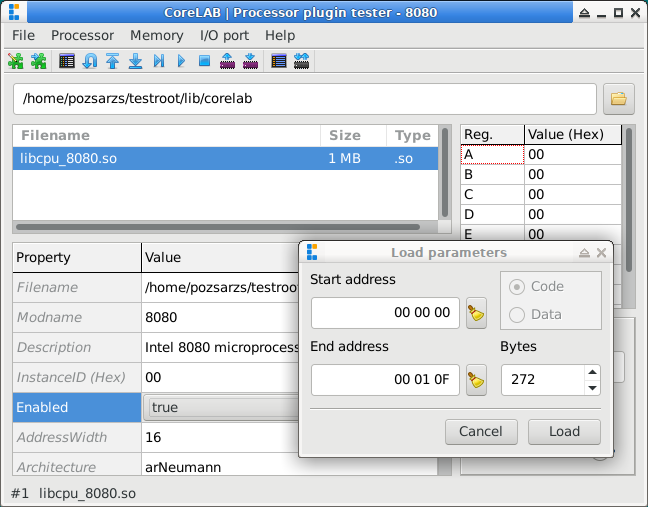
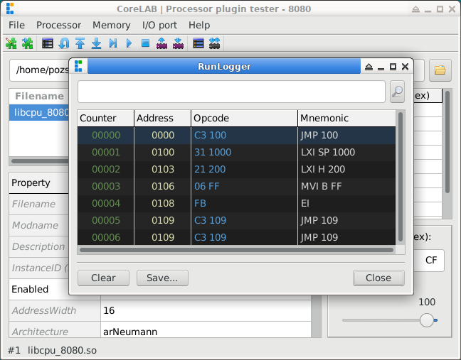
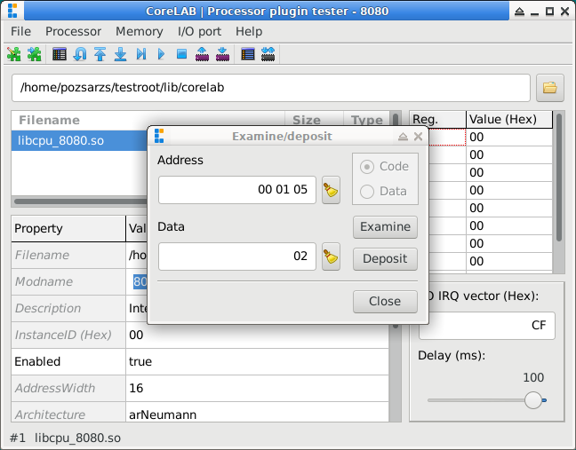

# CoreLAB

**Modular Processor Simulation Framework**

Copyright (C) 2026 Pozsár Zsolt <pozsarzs@gmail.com>  

## I. Introduction and Project Goals

The CoreLAB project is a functional 8 bits microprocessor and microcontroller
simulator born from a fusion of academic research, technical passion, and
historical preservation. The project was initiated with several key objectives
in mind:

[Homepage](index_hu.md)  

* **A Tribute to the Pioneers (Hardware and Human):** The project serves as a
    respectful nod to the early eras of computing architecture and the brilliant
    minds who designed them. By keeping the logic of these foundational
    processors alive, it preserves the digital heritage that paved the way for
    modern computing.
* **Learning Machine Code Programming:** It provides an accessible, hands-on
    educational platform to study low-level programming on classic architectures
    (such as the i40xx, i80xx, or TMS1000). Many of these physical chips are now
    rare, expensive, or completely obsolete, making software simulation the only
    viable way to experience them.
* **Academic Research (University Thesis):** The development of this simulator
    and its modular plugin system forms the core framework of my university
    thesis, exploring dynamic software architectures and instructional simulation
    methodologies.
* **Functional Execution over Full Emulation:** Unlike comprehensive emulators,
    the goal of CoreLAB is **not** to replicate entire vintage computer systems,
    run historical operating systems, or simulate cycle-accurate hardware quirks.
    Instead, it focuses strictly on the clean, functional execution of
    instructions, making the code's logic transparent and easy to analyze.
* **A Playground for System Design and Modeling:**  Beyond a simple educational
    tool, the project serves as a practical application of advanced system
    design and hardware modeling concepts. It provides a platform to explore
    how complex, real-world physical systems - such as buses, registers, memory
    layouts, and I/O lines - can be accurately modeled, decoupled, and
    reconfigured dynamically in software using modern software engineering
    patterns.
* **Bridging Vintage Logic with Modern Automation:** A key innovation of the
    project is wrapping these classic CPU architectures into a modern, scriptable
    environment. By allowing users to dynamically build topologies, manipulate
    registers, and automate tests via a command-line shell, it applies modern
    DevOps and debugging workflows to the foundational hardware of the past.

## II. Features

### General features

|Features                  |Specification / Description                                        |
|--------------------------|-------------------------------------------------------------------|
|**project type**          |Functional processor simulator                                     |
|**actual version**        |v0.1                                                               |
|**licence**               |EUPL v1.2                                                          |
|**language**              |en, hu                                                             |
|**architecture**          |amd64, armhf, i386, x86_64                                         |
|**operation system**      |FreeBSD, Linux, Windows                                            |
|**user interface**        |Graphical User Interface (GUI) with scriptable command-line control|
|**running modes**         |Normal or interpreter                                              |
|**simulation type**       |Instruction-level operation (not cycle-accurate)                   |
|**supported architecture**|Neumann and Harvard architectures                                  |
|**supported processors**  |Byte based uPs and simple MCUs                                     |
|**simulation environment**|Configurable memory space and virtual I/O ports or devices         |
|**modular architecture**  |Dynamically loadable CPUs and peripherals                          |
|**state saving**          |Saving and restoring full environment state                        |

### Integrated modules

|Features              |Specification / Description                            |
|----------------------|-------------------------------------------------------|
|**Breakpoint Manager**|Managing breakpoints                                   |
|**BusLogger**         |Logging system bus traffic                             |
|**HexViewer**         |Memory viewer component                                |
|**IntLogger**         |Logging interrupt requests                             |
|**Module Explorer**   |Managing module instances                              |
|**RegViewer**         |Real-time inspection of registers                      |
|**RunLogger**         |Real-time output of address, machine code, and mnemonic|
|**ScriptConsole**     |Console for show running script output                 |
|**ScriptEditor**      |Built-in environment for writing control scripts       |
|**SysConsole**        |Console for system messages and command line interface |

### Plug-in modules

|Features                               |Specification / Description                                                                  |
|---------------------------------------|---------------------------------------------------------------------------------------------|
|**Real Port Redirection**              |Bridges virtual port I/O streams directly to the physical hardware ports of the host machine.|
|**Simple Console**                     |Basic text-based console for data stream monitoring.                                         |
|**Virtual 7-Segment Display**          |Single and multiplexed 7-segment display arrays for numerical and basic character output.    |
|**Virtual CPU**                        |Emulated processor, microprocessor with custom architectures.                                |
|**Virtual Hexadecimal Display**        |Single and multiplexed hex display arrays mapped to virtual port addresses.                  |
|**Virtual LED Array and Matrix**       |Linear LED bars and dot-matrix displays for visual bit-state and coordinate-based output.    |
|**Virtual Memory (RAM/ROM)**           |Configurable volatile and non-volatile memory blocks with custom sizing and address mapping. |
|**Virtual Pushbutton Array and Matrix**|Linear and matrix-arranged momentary pushbuttons for interactive binary input.               |
|**Virtual Switch Array and Matrix**    |Linear and matrix-arranged toggle switches providing persistent binary data to virtual ports.|

## III. Screenshots

### CoreLAB framework application

### CLIOPort plugin tester application

### CLMemory plugin tester application

### CLProcessor plugin tester application

## VIII. Documentation and Help  

CoreLAB features built-in help and comprehensive documentation, accessible
through the following channels:

- Command-line assistance: Type the help command in the terminal to directly
  access usage guides and command references.
- Graphical Help: Under the Help menu in the graphical interface, you can find
  visual guides regarding the software's operation and supported CPU
  architectures.
- Source code documentation: Detailed developer assistance and documentation
  for the source code are available in the document folder.
- Additionally, you can view the manual page from *nix shell (_man corelab_) or
  _corelab.txt_ on other systems.  

## IX. Contributing  

If you find any bugs, please report them! I am also happy to accept pull
requests from anyone. You can use the GitHub issue tracker to report bugs, ask
questions, or suggest new features. See [CODE_OF_CONDUCT.md](CODE_OF_CONDUCT.md)
for details.  

## X. Links  

 - [Homepage](https://www.pozsarzs.hu/60_myprogcom/corelab/)  
 - [GitHub repository](https://github.com/pozsarzs/corelab/tree/CoreLAB8)  
 - [Project webpage on Github](https://pozsarzs.github.io/corelab)  

### Source packages  

|name                                                                                 |version|
|-------------------------------------------------------------------------------------|:-----:|
|[main.zip](https://github.com/pozsarzs/corelab/archive/refs/heads/CoreLAB8.zip)      |latest |
|[corelab-0.1.tar.gz](https://www.pozsarzs.hu/60_myprogcom/package/corelab-0.1.tar.gz)|v0.1   |

### Binaries and installer packages for several OS and architecture

Not all test versions have binary or installation packages.
To download, visit [CoreLAB's webpage](https://www.pozsarzs.hu/60_myprogcom/corelab/).

[^1]: [InpOut32 Github repository](https://github.com/ellysh/InpOut32)
