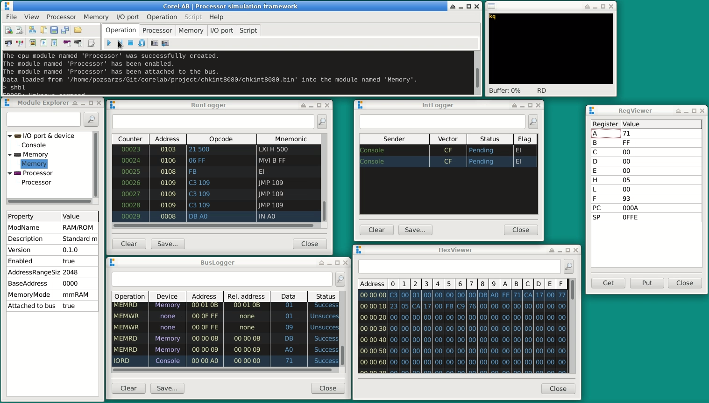

CoreLAB is a functional 8-bit microprocessor and microcontroller simulator. It
is not a traditional closed emulator, but a modern, scriptable environment for
studying the operation and low-level programming of classic architectures.

**Key features:**

* **Modular architecture:** Build a custom virtual hardware environment with
  dynamically loadable CPUs, memories, and peripherals.
* **Custom module development:** Write a custom processor or device module, or
  even a completely custom virtual CPU. You can use any programming language
  capable of creating `.so` or `.dll` files.
* **Modern automation:** Control the simulation from the command line, write
  tests, and automate using the built-in scripting language.
* **Built-in diagnostics:** Real-time register and memory inspection,
  step-by-step execution, and bus logging.

**Supported processors:** 

* Intel 4004 Harvard architecture 4 bit microprocessor (1971) - with 4001 and 4002 chips.
* Intel 4040 Harvard architecture 4 bit microprocessor (1974).
* Intel 8008 Neumann architecture 8 bit microprocessor (1972).
* Intel 8080 Neumann architecture 8 bit microprocessor (1974).
* Intel 8085 Neumann architecture 8 bit microprocessor (1976).
* Zilog Z80 Neumann 8 bit microprocessor (1976).

The full documentation, module descriptions, and source code are available on
the project's [GitHub page](https://github.com/pozsarzs/corelab).

Download the latest pre-compiled binaries and installers:
[GitHub Releases](https://github.com/pozsarzs/corelab/releases).

Copyright (C) 2026 Zsolt Pozsár - License: EUPL v1.2
