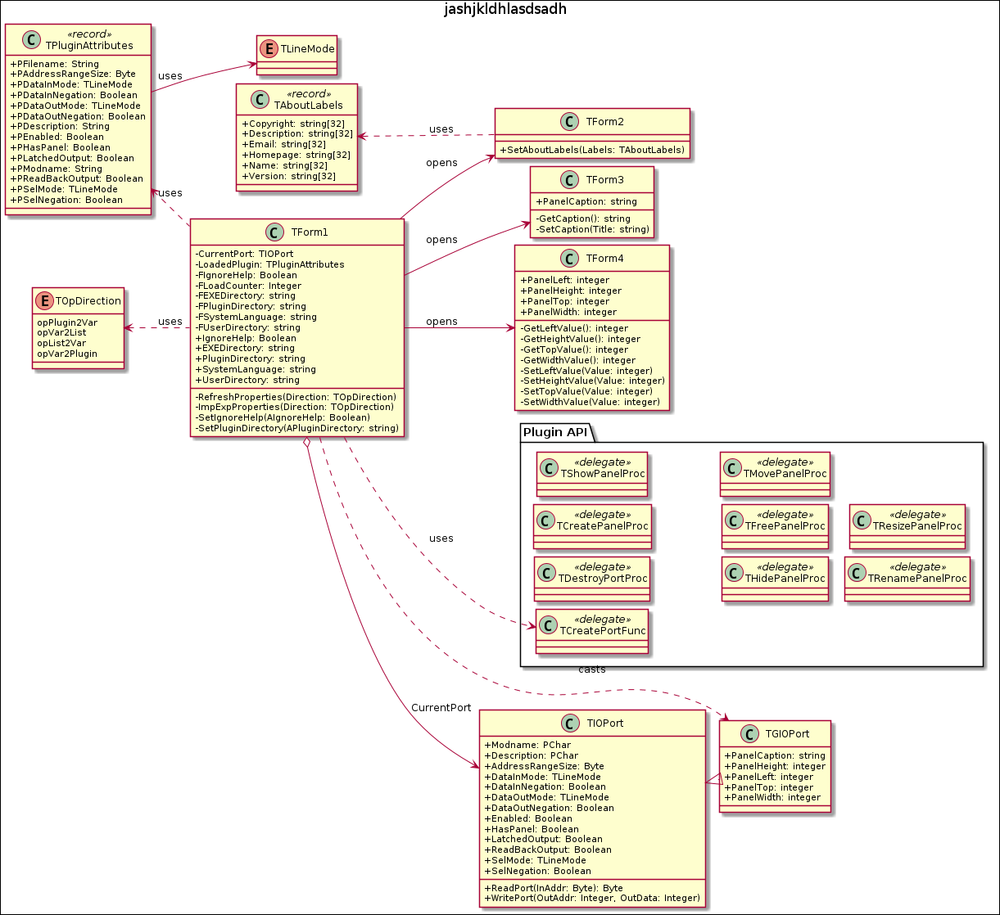

> [!NOTE]
> This documentation does not include fields and methods created by the IDE.
>

# CoreLAB

**Modular Processor Simulation Framework**

Copyright (C) 2026 Pozsár Zsolt <pozsarzs@gmail.com>  

## TForm3 from TForm class in frmCaption unit

(...)

### UML diagram

### Abbreviations

- _Ab_: means 'abstract',
- _Co_: means 'constant',
- _Il_: means 'inline',
- _Ol_: means 'overload',
- _Or_: means 'override',
- _Re_: means 'read',
- _Ri_: means 'reintroduce',
- _St_: means 'static',
- _Vi_: means 'virtual',
- _Wr_: means 'write'.

### Private methods

|name                                   |flags|description|
|---------------------------------------|:---:|-----------|
|`function GetCaption: string;`         |     |           |
|`procedure SetCaption(aTitle: string);`|     |           |

### Public properties

|name        |type  |flags|description            |default|
|------------|------|:---:|-----------------------|-------|
|PanelCaption|string|     |= GetCaption/SetCaption|       |
